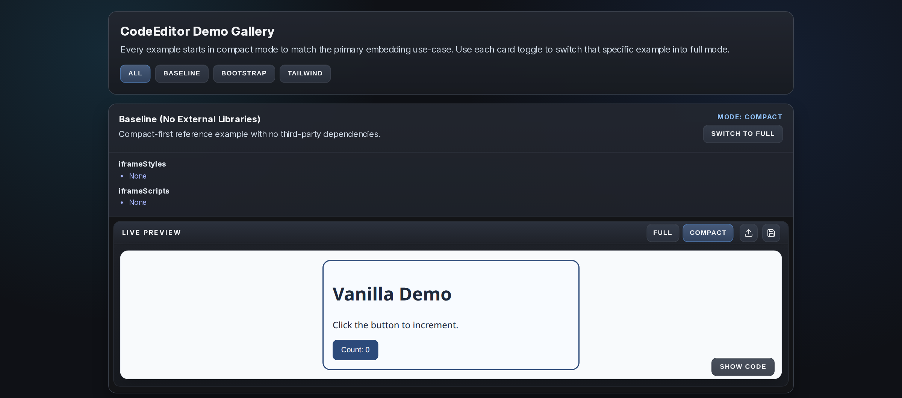
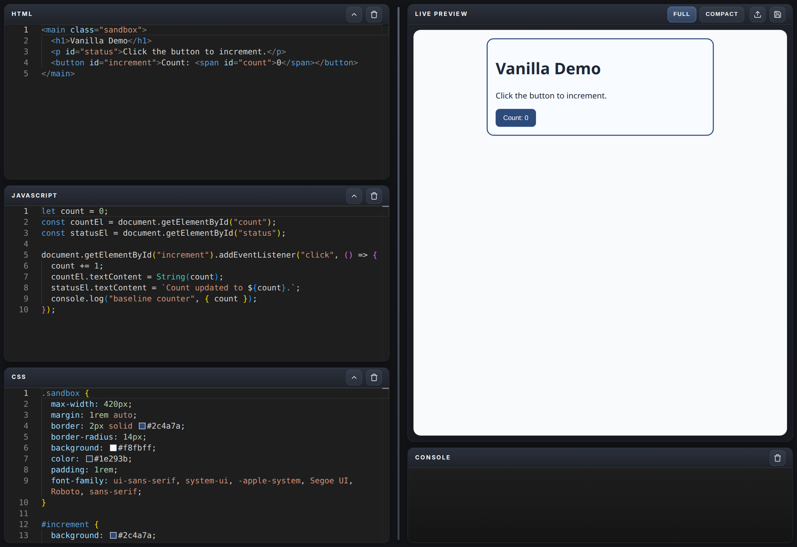
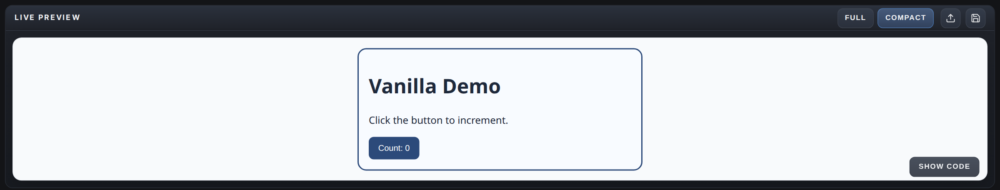

# CodeEditor

A React-based embeddable code editor with live HTML/CSS/JS preview.

## Screenshots

### Demo gallery



### Full editor layout



### Compact embedded layout



## Features

- Live HTML, CSS, and JavaScript editing
- Real-time preview with console output
- Embeddable as a standalone widget
- JSON import/export of editor state

## Installation

```sh
npm install @dropsy-ui/code-editor
```

## Usage

Use the UMD bundle in a browser page:

```html
<div id="editor-container"></div>
<script src="node_modules/@dropsy-ui/code-editor/dist/code-editor.umd.js"></script>
<script>
  const scripts = [];
  const styles = [];

  const editor = new CodeEditor('#editor-container', {
    scripts,
    styles,
    displayMode: 'compact',
    initialState: {
      html: '<h1>Hello</h1>',
      css: 'body { color: hotpink; }',
      javascript: "console.log('hello')"
    }
  });
</script>
```

`displayMode` controls the editor layout:
- `'compact'` for the embedded/mobile-friendly preview-first layout
- `'full'` for the side-by-side editor and preview layout

### Theme

The editor supports `'light'`, `'dark'`, and `'system'` themes. Pass `defaultTheme` to set an initial preference:

```html
<script>
  const editor = new CodeEditor('#editor-container', {
    defaultTheme: 'dark', // 'light' | 'dark' | 'system'
  });
</script>
```

If `defaultTheme` is omitted (or set to `'system'`), the editor follows the browser's `prefers-color-scheme` setting and defaults to dark when the browser reports a dark preference, or light otherwise.

A **theme toggle button** (sun/moon icon) is available in the Live Preview header by default, next to the Save and Load buttons. Clicking it switches between light and dark for the current session regardless of the initial default.

### UI Visibility Options

You can selectively hide parts of the embedded UI while keeping the live preview available:

```html
<script>
  const editor = new CodeEditor('#editor-container', {
    displayMode: 'compact',
    showModeToggle: false,
    showThemeToggle: true,
    showSaveButton: false,
    showUploadButton: false,
    showCode: true,
    showHtmlEditor: true,
    showJavaScriptEditor: false,
    showCssEditor: true,
  });
</script>
```

Available options:

- `showModeToggle`: show or hide the Full or Compact buttons
- `showThemeToggle`: show or hide the theme switcher
- `showSaveButton`: show or hide the Save button
- `showUploadButton`: show or hide the Upload button
- `showCode`: show or hide all code-editing UI
- `showHtmlEditor`: show or hide the HTML editor
- `showJavaScriptEditor`: show or hide the JavaScript editor
- `showCssEditor`: show or hide the CSS editor

If `showCode` is `false`, or if all three editor flags are `false`, the embedded editor becomes preview-only. In compact mode, the Show or Hide code button is hidden automatically when there are no visible editors.

### Third-Party Injection

You can pass external URLs through `scripts` and `styles` to load libraries inside the preview iframe.

```html
<script>
  const editor = new CodeEditor('#editor-container', {
    scripts: [
      'https://cdn.jsdelivr.net/npm/bootstrap@5.3.3/dist/js/bootstrap.bundle.min.js',
      'https://cdn.tailwindcss.com'
    ],
    styles: [
      'https://cdn.jsdelivr.net/npm/bootstrap@5.3.3/dist/css/bootstrap.min.css'
    ]
  });
</script>
```

### Editor State Import/Export

- Export: Click Save to download the current editor state as JSON.
- Import: Click Upload and select a previously saved JSON file.
- Programmatic seed: pass either individual props like initialHtmlCode/initialCssCode/initialJsCode or a single initialState object with html/css/javascript keys.

## Theming

Override any `--code-editor-*` CSS custom property in your app's `:root` (or any ancestor selector) to restyle the editor without touching library source. See [docs/THEMING.md](docs/THEMING.md) for the full variable reference — dark defaults, light-theme values, and guidance on per-instance overrides.

## Development Demo

In development, `src/main.tsx` renders `src/demo/DemoApp.tsx` (compact-first examples).

Distributed library entrypoint: `src/embed.tsx`.

---

For development and contributing, see [CONTRIBUTING.md](CONTRIBUTING.md).
